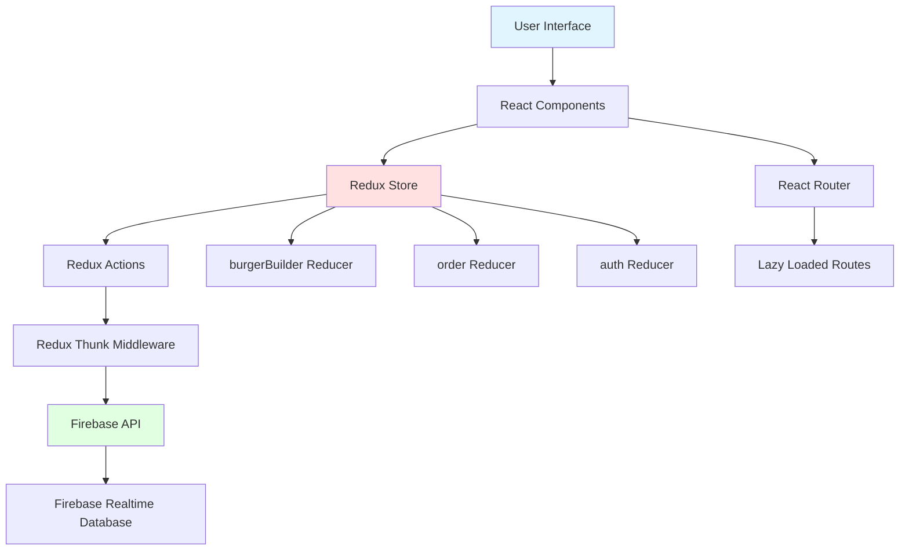
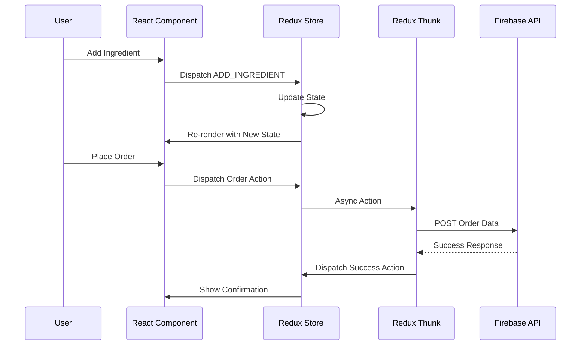
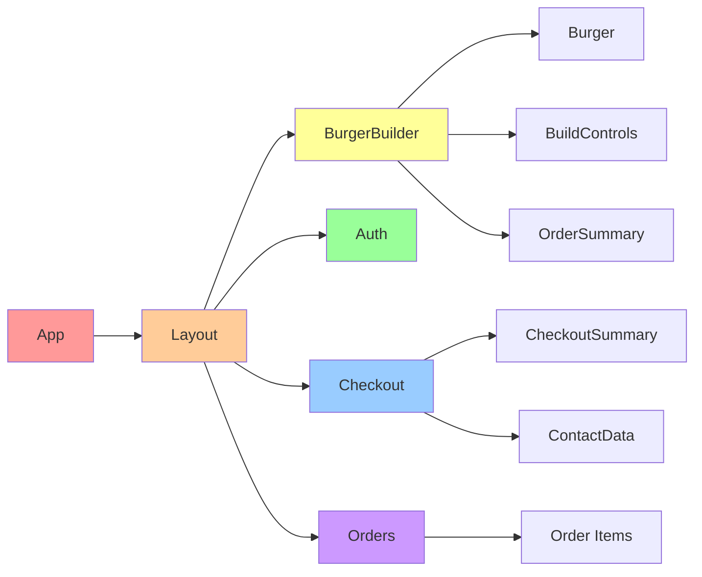

# Burger Builder

An interactive React application for building custom burgers with real-time pricing, user authentication, and order management. Built as part of the React Complete Guide course, showcasing modern React patterns, Redux state management, and Firebase integration.

Built in May 2018. This application demonstrates best practices in React development including Redux for state management, React Router for navigation, lazy loading, and authentication flows.

## Features

- 🍔 **Interactive Burger Builder**: Add and remove ingredients with real-time visual feedback
- 💰 **Dynamic Pricing**: See the total price update as you build your burger
- 🔐 **User Authentication**: Sign up and sign in with email/password
- 📦 **Order Management**: Place orders and view order history
- 🎨 **Responsive Design**: Works seamlessly on desktop and mobile devices
- ⚡ **Code Splitting**: Lazy loading for optimal performance
- 🔄 **Redux State Management**: Centralized state management with Redux and Redux Thunk
- 🌐 **Firebase Integration**: Backend powered by Firebase Realtime Database
- 🧪 **Tested Components**: Unit and integration tests using Jest and Enzyme

## Architecture



## Data Flow



## Component Structure



## Getting Started

### Prerequisites

- Node.js (v12 or higher)
- npm or yarn
- Modern web browser

### Installation

1. Clone the repository:
```bash
git clone https://github.com/orassayag/burger-builder.git
cd burger-builder
```

2. Install dependencies:
```bash
npm install
```

3. Start the development server:
```bash
npm start
```

4. Open [http://localhost:3000](http://localhost:3000) in your browser

### Configuration

For Firebase integration, update `src/api/api.js` with your Firebase configuration:
```javascript
const instance = axios.create({
    baseURL: 'https://your-firebase-project.firebaseio.com'
});
```

## Available Scripts

### `npm start`
Runs the app in development mode with hot reloading.

### `npm test`
Launches the test runner in interactive watch mode.

### `npm run build`
Builds the app for production to the `build` folder.

### `npm run lint`
Checks code for linting errors.

## Usage

1. **Build Your Burger**: Use the control panel to add ingredients (Salad, Bacon, Cheese, Meat)
2. **View Price**: Watch the total price update in real-time
3. **Authenticate**: Sign up or sign in to enable ordering
4. **Place Order**: Click "ORDER NOW" to proceed to checkout
5. **Enter Details**: Fill in delivery information and select delivery method
6. **View Orders**: Check your order history in the Orders section

## Technology Stack

- **React 16.4+**: UI library with component-based architecture
- **Redux 4.0**: State management with Redux Thunk for async actions
- **React Router 4.3**: Client-side routing with lazy loading
- **Axios 0.18**: HTTP client for API requests
- **Firebase**: Backend database and authentication
- **Enzyme & Jest**: Testing framework
- **CSS Modules**: Scoped component styling
- **Webpack 3**: Module bundler (via Create React App)

## Project Structure

```
burger-builder/
├── config/              # Build configuration
├── public/              # Static assets
├── scripts/             # Build scripts
├── src/
│   ├── api/            # API configuration
│   ├── components/     # Presentational components
│   ├── containers/     # Smart components (Redux-connected)
│   ├── hoc/            # Higher-order components
│   ├── store/          # Redux logic
│   │   ├── actions/   # Action creators
│   │   └── reducers/  # Reducers
│   ├── shared/        # Utility functions
│   ├── App.jsx        # Root component
│   └── index.js       # Entry point
└── package.json
```

## Redux Store Structure

```javascript
{
  burgerBuilder: {
    ingrediencies: {
      salad: number,
      bacon: number,
      cheese: number,
      meat: number
    },
    totalPrice: number,
    error: boolean
  },
  order: {
    orders: Array,
    loading: boolean,
    purchased: boolean
  },
  auth: {
    token: string | null,
    userId: string | null,
    error: object | null,
    loading: boolean,
    authRedirectPath: string
  }
}
```

## Testing

The project includes tests for critical components:
- `BurgerBuilder.test.jsx`: Main container tests
- `NavigationItems.test.jsx`: Navigation component tests
- `auth.test.js`: Authentication reducer tests

Run tests with:
```bash
npm test
```

## Deployment

### Firebase Hosting
```bash
npm run build
firebase deploy
```

### Other Platforms
Build and deploy to any static hosting:
- Netlify
- Vercel
- GitHub Pages
- AWS S3 + CloudFront

See [deployment documentation](https://facebook.github.io/create-react-app/docs/deployment) for details.

## Performance Optimizations

- **Code Splitting**: Routes are lazy-loaded using dynamic imports
- **Redux Optimization**: Selective re-renders with proper `mapStateToProps`
- **Memoization**: Component updates minimized with shouldComponentUpdate
- **Production Build**: Minified and optimized bundle

## Contributing

Contributions are welcome! Please read [CONTRIBUTING.md](CONTRIBUTING.md) for details on the code of conduct and the process for submitting pull requests.

## Author

* **Or Assayag** - *Initial work* - [orassayag](https://github.com/orassayag)
* Or Assayag <orassayag@gmail.com>
* GitHub: https://github.com/orassayag
* StackOverflow: https://stackoverflow.com/users/4442606/or-assayag?tab=profile
* LinkedIn: https://linkedin.com/in/orassayag

## Acknowledgments

- Built as the final project for "React - The Complete Guide" course by Maximilian Schwarzmüller
- Created with [Create React App](https://github.com/facebook/create-react-app)
- Powered by [Firebase](https://firebase.google.com/)

## License

This application has an MIT license - see the [LICENSE](LICENSE) file for details.
